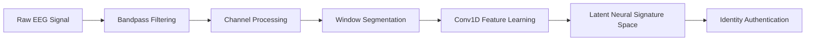
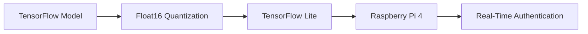

# Bio-Lock EEG

<div align="center">


<br>

### Brain Signal Biometrics • Deep Learning • NeuroAI • Security Research

<br>


</div>

---

## Overview

Bio-Lock EEG is a deep learning-based biometric authentication framework that identifies individuals through their unique neural activity patterns.

Unlike conventional biometric systems that rely on external physical characteristics, Bio-Lock EEG leverages electrical signals generated by the human brain to create identity-discriminative biometric signatures.

The system learns subject-specific neural representations directly from raw EEG recordings using a deep Conv1D architecture optimized for physiological signal learning and edge deployment.

---

## Why EEG Biometrics?

Traditional authentication methods rely on characteristics that can be observed, photographed, copied, or replayed.

EEG-based authentication introduces a fundamentally different security paradigm.

* Neural activity is generated internally.
* Signals require active physiological participation.
* Brainwave patterns exhibit subject-specific characteristics.
* Authentication inherently incorporates liveness.

### Advantages

* Intrinsic liveness detection
* Difficult to spoof
* Identity-specific neural signatures
* Continuous authentication potential
* Privacy-preserving on-device processing

---

# Research Snapshot

| Metric          | Value                |
| --------------- | -------------------- |
| Dataset         | PhysioNet EEGBCI     |
| Subjects        | 109                  |
| Signal Type     | EEG                  |
| Channels        | 64                   |
| Architecture    | Deep Conv1D          |
| Test Accuracy   | >99%                 |
| Validation      | 5-Fold Stratified CV |
| Deployment      | TensorFlow Lite      |
| Hardware Target | Raspberry Pi 4       |

---

# System Architecture



---

# Processing Pipeline

```text
EEG Acquisition
       │
       ▼
Signal Filtering
       │
       ▼
64-Channel Processing
       │
       ▼
Window Segmentation
       │
       ▼
Normalization
       │
       ▼
Deep Conv1D Learning
       │
       ▼
Neural Signature Extraction
       │
       ▼
Authentication Decision
```

---

# Model Architecture

The EEG authentication model employs a deeper Conv1D architecture to capture complex neural oscillatory patterns across multiple channels.

| Layer                  | Configuration       |
| ---------------------- | ------------------- |
| Conv1D                 | 64 Filters          |
| Conv1D                 | 128 Filters         |
| Conv1D                 | 256 Filters         |
| Conv1D                 | 512 Filters         |
| Batch Normalization    | After Each Block    |
| Global Average Pooling | Feature Compression |
| Dense                  | 1024 Units          |
| Dropout                | Regularization      |
| Output Layer           | 109 Classes         |

---

# Training Configuration

| Parameter    | Value                |
| ------------ | -------------------- |
| Optimizer    | Adam                 |
| Validation   | 5-Fold Stratified CV |
| Framework    | TensorFlow           |
| Dataset      | EEGBCI               |
| Subjects     | 109                  |
| Quantization | Float16 TFLite       |

---

# Dataset

## PhysioNet EEG Motor Movement / Imagery Dataset (EEGBCI)

| Attribute          | Value                    |
| ------------------ | ------------------------ |
| Subjects           | 109                      |
| Channels           | 64                       |
| Signal Type        | EEG                      |
| Source             | PhysioNet                |
| Recording Protocol | Motor Movement & Imagery |

The EEGBCI dataset represents one of the largest publicly available EEG datasets used for biometric authentication research.

---

# Experimental Results

## Authentication Performance

| Metric              | Value                    |
| ------------------- | ------------------------ |
| Test Accuracy       | >99%                     |
| Subjects Evaluated  | 109                      |
| Validation Strategy | 5-Fold Stratified CV     |
| Feature Learning    | End-to-End Deep Learning |

### Key Finding

The model successfully learns subject-specific neural representations capable of distinguishing between 109 individuals using only brain activity patterns.

---

# Neural Signature Analysis

To validate identity-discriminative learning, latent representations were analyzed using t-SNE dimensionality reduction.

### Observations

* Distinct subject clusters emerge naturally.
* Strong intra-subject consistency.
* Clear inter-subject separation.
* Learned embeddings encode neural identity information.

The resulting latent space demonstrates that the model captures genuine biometric characteristics rather than superficial signal artifacts.

---

# Deep Learning vs Classical Machine Learning

| Method                  | Performance |
| ----------------------- | ----------- |
| SVM + Spectral Features | ~78.6%      |
| Bio-Lock EEG Conv1D     | >99%        |

### Observation

End-to-end deep representation learning substantially outperforms handcrafted EEG feature engineering approaches on large-scale subject identification tasks.

---

# Edge AI Deployment

The trained model is optimized for embedded deployment through TensorFlow Lite float16 quantization.



### Benefits

* Reduced memory footprint
* Faster inference
* Lower computational overhead
* On-device biometric processing
* Privacy-preserving deployment

---

# Security Characteristics

## Neural Liveness

Authentication depends on actively generated neural activity, providing an inherent liveness component unavailable in traditional external biometric systems.

## Anti-Spoofing Potential

The system leverages:

* Neural oscillatory patterns
* Brain connectivity characteristics
* Learned deep neural signatures

to create a highly resilient biometric modality.

---

# Research Highlights

| Area          | Contribution              |
| ------------- | ------------------------- |
| Biometrics    | EEG-Based Authentication  |
| Deep Learning | Conv1D Architecture       |
| NeuroAI       | Neural Signature Learning |
| Dataset       | PhysioNet EEGBCI          |
| Validation    | 109 Subjects              |
| Deployment    | TensorFlow Lite           |
| Security      | Physiological Liveness    |

---

# Technology Stack

| Category          | Technology      |
| ----------------- | --------------- |
| Language          | Python          |
| Deep Learning     | TensorFlow      |
| Signal Processing | NumPy, SciPy    |
| Machine Learning  | Scikit-Learn    |
| Visualization     | Plotly          |
| Deployment        | TensorFlow Lite |
| Hardware Target   | Raspberry Pi 4  |

---

# Research Roadmap

* Cross-session EEG authentication
* Longitudinal neural signature stability analysis
* Adversarial robustness evaluation
* Real-time wearable EEG deployment
* Continuous neural authentication
* Full Bio-Lock ECG + EEG integration

---

# Project Status

| Component              | Status      |
| ---------------------- | ----------- |
| Literature Review      | Complete    |
| Dataset Preparation    | Complete    |
| Model Development      | Complete    |
| Performance Evaluation | Complete    |
| Edge Optimization      | Complete    |
| Hardware Validation    | In Progress |
| Manuscript Preparation | In Progress |

---

# Research Team

### Rohit Thanvi

**Centre of Excellence in AI & ML**
Swami Keshvanand Institute of Technology
Jaipur, Rajasthan, India

### Dr. Meenakshi Nawal

**Department of Computer Science & Engineering**
Swami Keshvanand Institute of Technology
Jaipur, Rajasthan, India

---

<div align="center">

### Secure Identity Through Neural Intelligence

*Brain Signals • Deep Learning • Security Research*

</div>
